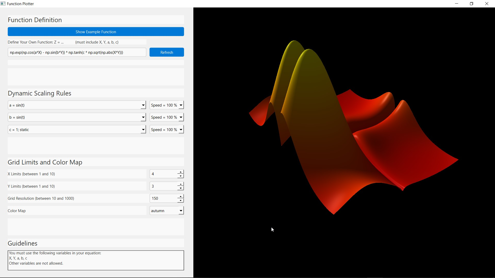
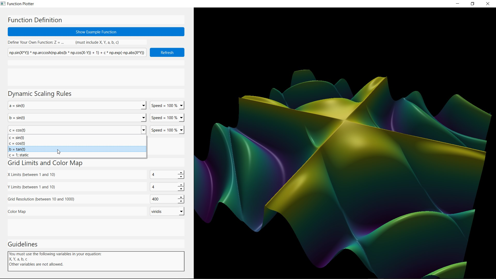

# ProjectGraphCreator

A 3D mathematical function plotter built with Python, Vispy, and PyQt6. Visualize and interact with mathematical surfaces defined by custom formulas, with real-time animation.

## Features

* Interactive 3D surface plotting of user-defined mathematical functions
    * Define your own function using variables X, Y, a, b, c and numpy functions
    * Real-time animation of parameters a, b, c with configurable scaling rules (sin, cos, tan, or static)
    * Adjustable speed for each parameter's animation
    * Drag and zoom graphs with mouse
* PyQt6 interface
* Adjustable grid resolution and axis limits
* Different color maps for surface visualization
* Example functions for inspiration and demonstration
* Input validation to ensure only allowed variables and functions are used

## Requirements

* Python 3.10+
* Vispy
* PyQt6
* numpy

